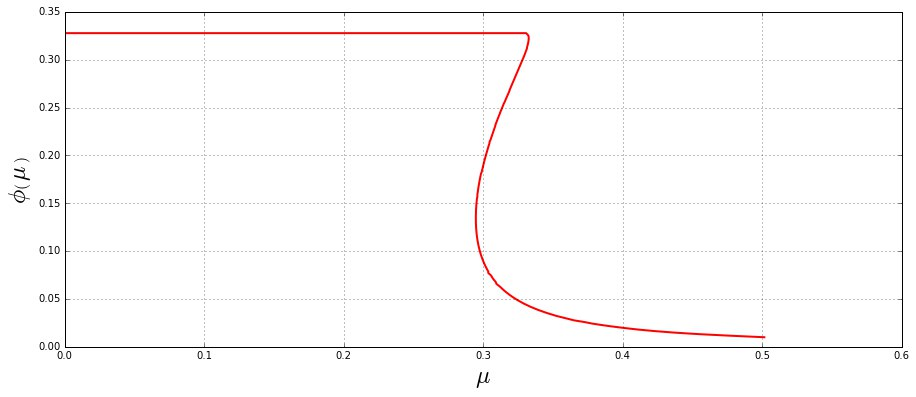
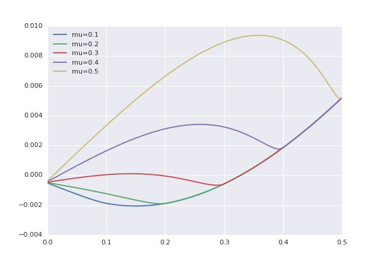
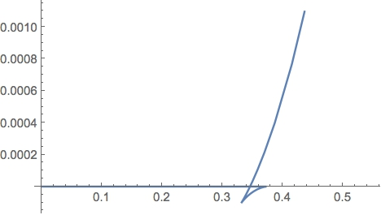

# Grand canonical thermodynamic potential for quark matter

This is the first numerical project of the fall term of the MPNP-2017 course, which is described in the first problem sheet by David Blaschke. The model we study here is largely oversimplified, compared to real-world problems, but using this toy model we can study the main features of the "chiral phase transition" from massive to (approximately) massless fermions.

The model is formulated by the following thermodynamic potential:

\begin{gather}
    \Omega(\phi; \mu, T) = \frac{\phi^2 - \phi_0^2}{4 G_1} - \frac{6}{\pi^2} \int\limits_0^\infty dq q^2 \Big\{E_\phi(q) - E_{\phi_0}(q) + T \ln[1+ \exp(- \frac{E_\phi(q) - \mu}{T})] + T \ln[1+ \exp(- \frac{E_\phi(q) + \mu}{T})] \Big\},
\end{gather}

where $\phi$ is the mean-field value of some scalar boson field $\phi$, the spectrum of quarks for a fixed value of the field $\phi$ is given by $E_\phi(q) = \sqrt{q^2 + (m + g(q) \phi)^2}$ and $\phi_0$ is the equilibrum value of $\phi$ at $T=0; \mu=0$. The interaction among quarks is wrapped with the Gaussian formfactor $g(q) = \exp(-q^2/\Lambda^2)$, $\Lambda = 891 \, {\rm MeV}$. Parameter $G_1  =3.881/\Lambda^2$ is the coupling constant and m = $2.177$ MeV is the bare quark mass.

Questions below are to be answered each in a separate `.ipynb` file. You can use usual `$...$` notation to include LaTeX formulae in a cell, which has to be switched to Markdown mode before (RTFM, please, and don't forget to consult the Keyboard shortcut section of the Jupyter Notebook help)

Figures below I took from other students' results from the previous year. Don't pay attention to numbers on them - their sole purpose is to show the expected dependences qualitatively.

#### 1. Preliminaries 

For numerical calculations all the expressions have to be made dimensionless by an appropriate choice of scales for the quantities in the expression. 
* Propose a choice of units such that $\mu, T, \phi, \Omega, G_1, ...$ will have give _not too small and not too large_ values for their corresponding variables in your program. 

* Remember that all the formulae are written in $\hbar = c = 1$ units. Important relation: $1 = \hbar c = 197.33 \, {\rm MeV}\cdot{\rm fm}$. What is the effective range of the interaction in this model in units of ${\rm fm}$?

#### 2. Vacuum condensate 

* Derive the expression for $\Omega$ and the equation for the order parameter ($D(\phi) \equiv \dfrac{\partial \Omega}{\partial \phi} = 0$) at $T = 0$ 

* Use your favorite numerical method from one of the Python scientific libraries to find a solution of this equation for $\phi(T=0, \mu=0)$ for the set of parameters defined above. Perform the calculation in dimensionless units (see 1) and express the result in units of MeV or GeV. This parameter determines the mass of a quark "in a nucleon consistent of 3 quarks" (so-called constituent quark mass), so the value should be close to $940 \, {\rm MeV}/3$.

* Try to find a root of the equation by using a method not for root finding, but using the gradient descent-like method for numerical minimization. This means, that the root finding (if the root is known to exist) is equivalent to minimizing $||\dfrac{\partial \Omega}{\partial \phi}||$. This will be useful in future for finding a root of a system of non-linear equations.  

#### 3. In-medium change of the condensate

* Find the solution for the $\phi(T=0)$ as a function for the chemical potential $\mu$. 

The result should look like 


so the order parameter has multiple solutions for some range of $\mu$. Formulate the problem in a convenient way to find all the branches of $\phi(\mu)$ in one run.

* Plot the $D(\phi; T=0)$ and $\Omega(\phi; T=0)$ for a set of $\mu$ to learn which solutions corresponds to minima and which to maxima of $\Omega$.

For $D(\phi)$ you will see a figure like this:



and for $\Omega(\phi)$ you will see a figure with two minima (for $\mu$ in the reange with multiple solutions), like in Landau theory of phase transitions (cf. phenomenology of ferromagnetism from statistical physics course)

* Plot the pressure $P = - \Omega$ as a function of $\mu$ with self-consistent $\phi(\mu)$. Find a chemical potential of the self-intersection point $\mu^*$ (in normal units), which is the point of phase transition. Use the plots of $\Omega(\phi)$ for various $\mu$ from the previous task to prove that the new phase (with lower $\phi$) becomes energetically more favorable at the point of phase transition.

Qualitatively it looks like this:


#### 4. Change of the phase transition with increase of the temperature.

* Implement all the steps from parts 2. and 3. for $T > 0$. 

* Find the critical temperature $T_c$, at which the multiple solutions disappear. Plot the figures, analogous to those in part 3., for a fixed $\mu$ near $\mu^*$ and several temperatures below and above the $T_c$.

* Find the dependence $\mu^*(T)$, plot it and determine the critical point

#### 5. Fit of the pressure by the bag model

* Fit the resulting quark matter pressure for $T = 0$ with the following 1-parameter formula:

\begin{gather}
    P_{bag}(\mu) = \frac{\mu^4}{2 \pi^2} - B, \quad \mu > \mu^*,
\end{gather}
by adjusting the parameter $B$ and making a least-square fit using a function from `scipy` (or any other) library


```python

```
